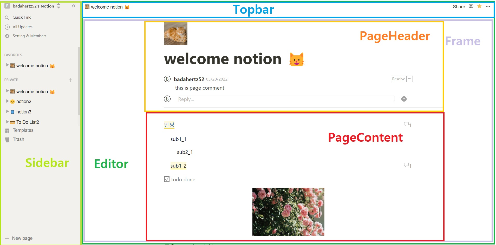
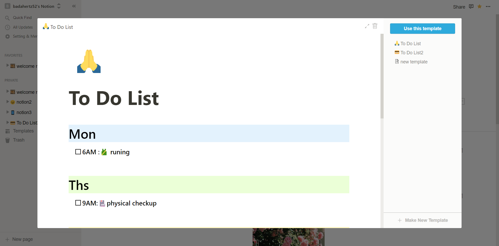
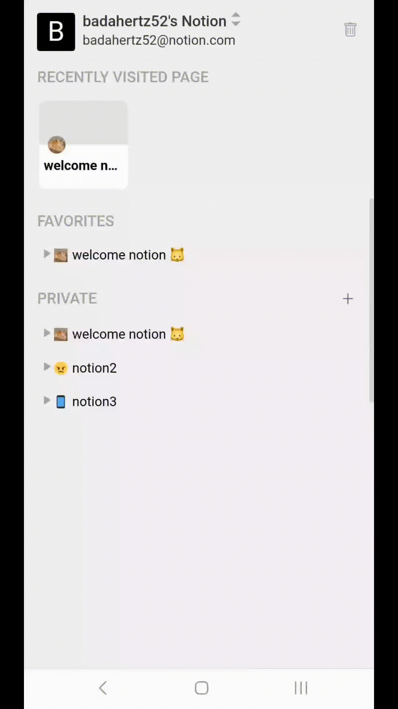

# Notion

해당 프로젝트는 [Notion](https://www.notion.so/)을 react를 사용하여 직접 레이아웃과 기능들을 분석하 클론 코딩한 프로젝트입니다.

## [노션 프로젝트 바로가기](https://badahertz52.github.io/notion)

## Index

#### <a href="#builtWith">1.Tech skill & Built with</a>

#### <a href="#start">2. Getting start</a>

#### <a href="#description">3. Description</a>

- <a href="layout">1) Layout</a>

- <a href="data">2) Data</a>

- <a href="function">3) Function</a>

#### <a href="#update">4. Update </a>

---

## <div id="builtWith">1. Tech skill & Built with </div>

### 1) Tech skill

- HTML
- Type script , Java Script
- SCSS , styled-components
- React
- Redux

### 2) Built with

- node-html-markdown
- [react-contenteditable](https://www.npmjs.com/package/react-contenteditable)
- [react-icons](https://www.npmjs.com/package/react-icons)
- react-redux, redux
- react-router-dom
- [styled-component](https://styled-components.com/)

---

## <div id="start"> 2. Getting start </div>

### 1) Prerequiste

- node.js
  <br/>
  [node.js 설치하러 가기](https://nodejs.org/ko/download/)

- npm

```
 npm install npm@latest -g
```

### 2) Start

```
npm i
```

---

## <div id="description"> 3.Description </div>

## <div id="layout">1) Layout</div>

- Main
  - Sidebar
  - Editor
    - Topbar
    - Frame
      - Page header
      - Page content



- Template


<br/>

- Resposible web - Mobile 화면 (sideMenu)
  <br/>

  

## <div id="data"> 2) Data </div>

## A. State

## a. Notion State

- Notion State type
  ```typescript
  type Notion = {
    //모든 page와 template의 id
    pagesId: string[] | null;
    //모든 page와 template
    pages: Page[] | null;
    //부모 page가 없는, 최상위에 있는 page들의 id
    firstPagesId: string[] | null;
    //모든 tempplate의 id
    templatesId: string[] | null;
    // 삭제된 page의 id와 page들
    trash: {
      pagesId: string[] | null;
      pages: TrashPage[] | null;
    };
  };
  ```
- Page type
  ```typescript
  type pageType = typeof page | typeof template;
  type Page = {
    id: string;
    type: pageType;
    header: {
      title: string;
      iconType: IconType;
      icon: string | Emoji | null;
      cover: string | null;
      comments: MainCommentType[] | null;
    };
    // block.firstBlock === true인, 부모 block이 없는 블럭을 firstBlock라고 함
    firstBlocksId: string[] | null;
    blocks: Block[] | null;
    blocksId: string[] | null;
    // 해당 page의 자식 page를 subPage라고 함
    subPagesId: string[] | null;
    // 해당 page의 상위 page의 id를 원소로 하는 배열
    parentsId: string[] | null;
    editTime: string;
    createTime: string;
  };
  ```
- Trash type
  ```typescript
  type TrashPage = Page & {
    subPages: Page[] | null;
  };
  ```
- Block type

  ```typescript
  //block.style.color(block의 글자색)의 type
  type ColorType =
    | typeof defaultColor
    | typeof grey
    | typeof orange
    | typeof green
    | typeof blue
    | typeof red;

  //block.style,bgColor (block의 배경색)의 type
  type BgColorType =
    | typeof bg_default
    | typeof bg_grey
    | typeof bg_yellow
    | typeof bg_green
    | typeof bg_blue
    | typeof bg_pink;

  //block.style의  type
  type BlockStyle = {
    color: ColorType;
    bgColor: BgColorType;
    width: undefined | string;
    height: undefined | string;
  };

  // block.type의  type
  type BlockType =
    | typeof text
    | typeof toggle
    | typeof todo
    | typeof todo_done
    | typeof image
    | typeof bookmark
    | typeof h1
    | typeof h2
    | typeof h3
    | typeof page
    | typeof numberList
    | typeof bulletList
    | typeof numberListArr
    | typeof bulletListArr;

  //block.icon의 type
  type IconType = typeof img | typeof emoji | null;

  //block.comments 에 대한 type
  //block.comments는 mainComment-subComment 구조
  type SubCommentType = {
    id: string;
    userName: string;
    content: string;
    editTime: string;
    createTime: string;
  };

  type MainCommentType = SubCommentType & {
    type: "open" | "resolve";
    selectedText: null | string;
    subComments: SubCommentType[] | null;
    subCommentsId: string[] | null;
  };

  type Block = {
    id: string;
    contents: string;
    firstBlock: boolean;
    //해당 block의 자식block을 subBlock이라 함
    subBlocksId: string[] | null;
    //해당 block의 모든 상위 block의 id
    parentBlocksId: string[] | null;
    type: BlockType;
    iconType: IconType;
    icon: string | Emoji | null;
    editTime: string;
    createTime: string;
    style: BlockStyle;
    comments: MainCommentType[] | null;
  };
  ```

- Notion Action type
  ```typescript
  type NotionAction =
    | ReturnType<typeof add_block>
    | ReturnType<typeof edit_block>
    | ReturnType<typeof change_block_to_page>
    | ReturnType<typeof change_page_to_block>
    | ReturnType<typeof delete_block>
    | ReturnType<typeof change_to_sub>
    | ReturnType<typeof raise_block>
    | ReturnType<typeof add_page>
    | ReturnType<typeof duplicate_page>
    | ReturnType<typeof edit_page>
    | ReturnType<typeof move_page_to_page>
    | ReturnType<typeof delete_page>
    | ReturnType<typeof restore_page>
    | ReturnType<typeof clean_trash>
    | ReturnType<typeof add_template>
    | ReturnType<typeof cancel_edit_template>
    | ReturnType<typeof delete_template>;
  ```

## b. User State

- User State type

```typescript
type UserState = {
  userName: string;
  userEmail: string;
  favorites: string[] | null;
  //최근에 방문한 page의 id
  recentPagesId: string[] | null;
};
```

- User Action type

```typescript
type UserAction =
  | ReturnType<typeof add_favorites>
  | ReturnType<typeof remove_favorites>
  | ReturnType<typeof add_recent_page>
  | ReturnType<typeof clean_recent_page>;
```

## c. Side State

- Side State type

  ```typescript
  type SideAppear =
    | typeof lock
    | typeof float
    | typeof floatHide
    | typeof close;

  type Side = {
    appear: SideAppear;
  };
  ```

- Side Action type
  ```typescript
  type SideAction = ReturnType<typeof change_side>;
  ```

## B. Component

- AllComments

  - 페이지 내의 모든 comment를 보여주는 component

- BlockComponent ,BlockConentEditable

  - BlockComponent : EditableBlock component 의 자식 component이자 BlockContentEditable의 부모 component로 block의 type별 다른 html element를 보여준다
  - BlockContentEditable : block 의 content에 대한 component로 content를 수정할 수 있음

- BlockFn

  - 웹 브라우저 환경에서 block에 마우스를 가져다 내면 block 왼편에 나타나는 component로 block을 생성하는 add 버튼과 Menu를 여는 버튼을 가짐

- BlockStyler

  - block 의 일부 내용을 선택 시 나타나고, 일부 내용에 대한 스타일 변경,링크 추가, block의 타입 변경등을 담당

- ColorMenu

  - block의 글자 색과 배경색을 변경할 수 있음

- CommandBlock

  - block의 타입을 변경함
  - 웹 브라우저에서 "/"를 선두로 block type을 작성함으로써 block type을 변경할 수 있음

- Comments

  - block에 대한 comments들을 보여주고, comment를 생성,수정,삭제할 수 있음

- EditableBlock

  - BlockComponent의 부모 component로 block 의 type, block의 subBlocksId의 여부에 따라 다른 html을 보여줌

- Export
  - 현재 페이지를 pdf,html,markdown으로 내보낼 수 있는 기능을 담당
  - 현재 페이지를 내보낼 때 해당 페이지의 subPage를 같이 내보낼 것 인지, 해당 페이지 내 이미지들도 같이 내보낼 것인지 선택할 수 있음
- Frame

  - page를 화면에 보여줌

- IconModal

  - 아이콘을 추가,수정 시 사용됨

- ImageContent

  - block 타입이 image인 block의 image 파일을 보여주는 component
  - 이미지 상하좌우에 있는 버튼을 통해 이미지의 사이즈를 조절할 수 있음

- LinkLoader

  - BlockStyler에서 링크를 추가할 때 사용됨

- Loader

  - icon이나 cover에서 image 파일을 사용할 경우 사용되는 component

- Loading

  - 페이지 로딩 시 나타남

- Menu
  - block에 대한 복제,삭제,이동,타입 변경,comment 추가,color 변경등을 할 수 있는 component
- MobileBlockMenu
  - 모바일 브라우저에서 특정 블록을 선택하면 해당 블럭에대한 여러 기능을 하는 메뉴 컴포넌트
    - 새로운 블록 추가
    - 해당 블록 삭제
    - 해당 블록에 대한 comment 추가
    - 해당 블록의 type 변경
    - 해당 블록에 대한 폰트 색깔, 배경 색깔 설정
    - Menu 창을 여는 기능
- MobileSideBlockMenu
  - MobileBlockMenu 의 sideMenu
- MoveTargetBlock

  - block의 위치를 이동 시킬 때, 이동되는 block을 화면상에 보여주는 component

- PageIcon

  - page.header.icon을 보여주는 component

- PageMenu

  - block이나 page를 다른 page로 이동시킬 경우 page를 검색할때 검색 결과를 보여주고, block이나 page를 다른 page로 이동시켜줌

- QuikFindBoard

  - Sidebar에서 page를 검색하고 page 클릭 시 해당 page를 열 수 있는 기능을 담당함

- Rename

  - page의 title이나 icon를 변경할 경우 나타나는 component로 해당 component를 통해 title이나 icon을 변경할 수 있음

- SideBar

  - 페이지 목록을 볼 수 있고, 페이지를 열 수 있으며 페이지의 icon,title을 수정할 수 있고 페이지를 생성,삭제할 수 있고 Templates,Trash,QuickFindBoard를 열 수 있음

- Templates

  - user의 template들을 보여주고, 수정하고 삭제할 수 있으면 새로운 template를 만들 수 있는 component

- Time

  - block이나 page의 생성,수정등의 시간을 보여주는 component

- TopBar

  - Editor 상단에 위치하는 component로 페이지 경로 표시와 <a href="#topBar_function">페이지에 대한 여러 기능</a>을 담당하는 버튼들이 있음

- Trash
  - 삭제된 page들을 볼 수 있고 삭제된 page를 영구삭제하거나 복원할 수 있음

## <div id="function"> 3) Function </div>

레이아웃을 기준으로 notion에서 사용할 수 있는 기능들을 설명하겠습니다.

### A. Sidebar

#### Sidebar simulation


- 사이드바 모양 변경(왼쪽에 고정, 감추기, 띄우기)
- Quik Find: 페이지 찾기
- 페이지옆에 생성되는 메뉴버튼: 페이지 생성,삭제,페이지 타이틀이나 아이콘 변경, 다른 페이지로 이동, 즐겨찾기에 추가 또는 삭제
- 휴지통 : 삭제된 페이지 영구 삭제 또는 복구

### B. Templates

#### 📼 Templates simulation


- template 열기
- template 수정
- template 생성
- template 삭제
- template 이용
  - use template 버튼을 누르면 현재 오픈된 페이지의 내용이 template의 내용으로 교체됨

### C. Editor

#### 📼 Export page to PDF or Html or Markdown simulation


### <div id="topBar_function"> a. Topbar </div>

#### 📼 Topbar simualtion


- 페이지 경로 표시, 다른 페이지로 이동
- 현재 페이지내 모든 코멘트 보기
- 즐겨찾기 추가, 삭제
- 페이지 스타일 변경: 글자크기,글자 스타일, 페이지 너비
- 페이지 삭제
- 현재 페이지를 다른 페이지로 이동
- 현재 페이지를 pdf,html,markdown 형태로 저장 (현재 페이지 내의 이미지 파일 포함여부와 현재 페이지 내의 다른 페이지도 저장하는 지 여부 선택할 수 있음)

### b. Frame

### a) PageHeader

- 현재 page의 타이틀, 아이콘, 커버, comment 추가/변경/삭제 가능

#### 📼 pageHeader simulation


### b) PageContent

- 새로운 페이지 작성 시 옵션 선택
  - 옵션
    - 페이지 아이콘 추가
    - 페이지 아이콘을 랜덤으로 추가
    - 템플릿 이용
- 페이지 내 글 (block)에 대한 기능
  - block생성
    - 페이지 하단 클릭 시 새로운 블록 생성
    - 작성 중인 block에서 enter 키 누르면, 끝에서 누를 경우는 내용이 빈 블록이 생성되고 block의 내용 중간에서 enter키 누르면 커서 뒷 부분의 내용을 가진 블록이 생성
    - 블럭 옆에 생성된 "+" 버튼을 눌러서 새로운 블록 생성
- block 복제
- block 내용 수정
- image 타입의 block의 경우 image의 사이즈를 수정 가능
- block 타입 수정
  - 빈 블록에서 "/" 입력으로 블록 타입을 수정할 수 있는 command 창을 열어서 블록 타입을 수정
  - 메뉴(Menu), 블럭 내 내용 선택(BlockStyler)을 통해서 타입 수정
- block 스타일 변경
  - block 전체 스타일 변경 (Menu)
  - block 내 일부 스타일 변경 가능 (BlockStyler)
- block에 링크 추가
- block에 대한 comment 생성,comment 속성(open,resolve)변경, 삭제
- block 삭제
  - 내용이 빈 블록에서 backspace를 누르면 해당 블록 삭제
  - 메뉴에서 해당 블록 삭제 가능
- page 내 block 위치 변경
  - 마우스 드래그를 통해 block 의 위치를 변경
  - 변경된 위치에 따라 block의 부모 block과 subBlock(자식 block), page.firstBlocksId 에 변동 사항이 생길 수 있음
- tab 키와 backspace 키를 통해 block 들여쓰기 내여쓰기 가능
- 키보드 방향키를 통한 블록간의 커서 이동
- 블럭을 다른 페이지로 이동

#### 📼 PageContent simulation

- block 생성 및 타입 변경


- image 타입 블럭 생성 및 image 사이즈 변경


- comment


- blockStyler - web browser


- blockStyler - mobile browser


  
* 다른 페이지로 블럭 이동


- 블록 위치 변경 - web browser


- 블록 위치 변경 - mobile browser


- 기타: 키보드를 통한 조작, 블럭 삭제, 블럭 내용 선택등등


- menu - mobile browswer


- sideMenu of menu - mobile browswer


---

## <div id="update">4. Update </div>

- 2022.12 업데이트
  - sideBar,allComment 변경,<span style="text-decoration:line-through"> MoblieMenu 추가 </span>, 모바일에서도 ImageContent 사이즈 변경가능하도록 수정
    <br/>
- 2023.3 업데이트 및 수정

  - 모바일 브라우저에서 사용될 block 에 대한 메뉴와 그 사이드 메뉴를 담당하는 MobileBlockMenu, MobileSideMenu 추가

  - 모바일 브라우저에서도 block의 contents 중 특정 글자를 선택할 때 해당 글자에 대한 BlockStyler 의 기능을 사용 가능

  - block 전체 뿐만 아니라 일부 내용에 대해서도 commment 추가 할 수 있음

  - 모바일 브라우저에서 블럭간 이동이 안되는 오류 수정

---

- 🔎 [Notion 프로젝트 후기 보러가기](https://velog.io/@badahertz52/Notion-프로젝트-후기)
